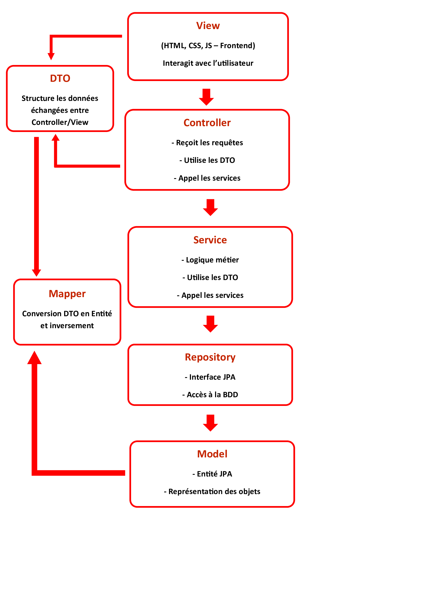
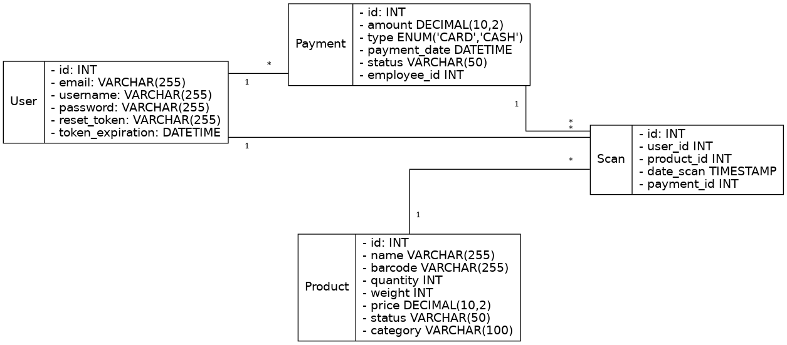
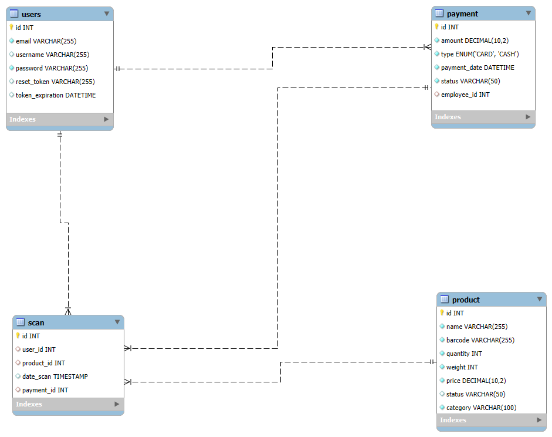

# StockMeat Solutions

Application web sécurisée de gestion des stocks de viande non achetée, destinée à la revente aux employés de l’entreprise.
Développée en **Java avec Spring Boot**, elle combine une interface intuitive, une sécurité renforcée, et une architecture modulaire adaptée aux environnements professionnels.

---

## Objectifs de l'application

- Optimiser la gestion des invendus carnés en entreprise
- Faciliter la revente aux salariés via une interface web sécurisée
- Garantir la traçabilité des produits et la conformité réglementaire
- Offrir une solution déployable en local ou en cloud, avec configuration adaptable

---

## Architecture

Le projet suit une architecture MVC organisée en plusieurs couches :

- Model → Entités métiers : Product, User, Payment, Scan

- Repository → Interfaces JPA pour l’accès à la base de données

- Service → Logique métier (gestion produits, paiements, factures…)

- Controller → Envoie les données à la vue aux pages HTML (formulaires HTML avec Thymeleaf)

- DTO & Mapper → Communication sécurisée entre couches

- Exception → Gestion des erreurs personnalisées

- Configuration → Sécurité, beans



## Base de données

- Langage utilsé : MySQL
- Modélisation : Diagramme de classe (UML)
- Principales entités :

User : gestion des employés et rôles (admin, user)

Product : informations sur les viandes (type, poids, prix, code-barres EAN-13)

Payment : suivi des paiements (montant, date, mode)

Scan : enregistrement du code-barres scanné (via scanner)

## Diagrammes

• **Diagramme UML** montre les relations entre les différentes tables et leurs éléments.


• **Diagramme MPD** montre comment les données de l'application sont structurées et liées.


## Fonctionnalités

- Authentification sécurisée (Spring Security + BCrypt)

- Gestion des utilisateurs (inscription, connexion, déconnexion)

- Réinitialisation du mot de passe par e-mail (via Brevo)

- Gestion des produits (CRUD)

- Tableau de bord administrateur

- Filtrage et recherche des produits

- Réservation des produits par les employés

- Suivi des stocks et des ventes

## Technologies utilisées

- Backend : Java, Spring Boot

- Sécurité : Spring Security (authentification)

- Base de données : MySQL + JPA/Hibernate

- Frontend : Thymeleaf, HTML, CSS, JavaScript

- Tests : JUnit 5, Mockito, MockMvc (unitaires & intégration)

- Documentation : JavaDoc, JaCoCo, Surefire (rapports HTML)

- CI/CD : GitHub Actions

- Conteneurisation : Docker & Docker Compose

- Déploiement : VPS (clé SSH + nom de domaine via LWS)

- Mails : Brevo (réinitialisation mot de passe & envoi facture PDF)

- PDF : OpenPDF (com.github.librepdf:openpdf)

- Scanner code-barres : Datalogic Touch TD1100

## Sécurité

- Authentification via Spring Security

- Mots de passe encodés avec BCrypt

- Connexion sécurisée en HTTPS

- Réinitialisation du mot de passe via Brevo

- Protection des routes sensibles : accès après authentification

## Installation

### 1. Prérequis

Assurez-vous d’avoir installé :

- Java 17
- Maven
- Git
- Une base de données **MySQL**
- Docker

### 2. Cloner le projet

```bash
git clone https://github.com/ton-compte/stockmeat-solutions.git
cd stockmeat-solutions
```

### 3. Configuration

**application.properties**

- Créez une base de données
- Ouvrez le fichier `application.properties` et configurez vos informations :

```
spring.datasource.url=jdbc:mysql://localhost:3306/stockmeat_db
spring.datasource.username=mon_user
spring.datasource.password=mon_password
spring.jpa.hibernate.ddl-auto=update
```

**Profils Spring**

L’application utilise des profils de configuration (dev, prod, test) pour adapter le comportement selon l’environnement :

```
spring.profiles.active=dev
```

**Docker**
Un fichier docker-compose.yml est fourni pour lancer l’application et la base de données en containers :

```bash
docker-compose up --build
```

**Lancer l’application**

Avec Maven :

```bash
mvn spring-boot:run
```

Ou directement depuis VS Code

## Déploiement

1. CI/CD avec GitHub Actions

- Build, tests, génération des rapports, création des images Docker.

2. Conteneurisation avec Docker

- Dockerfile et docker-compose.yml pour lancer l’app et MySQL.

3. Déploiement sur VPS (LWS : hébergeur français)

- Connexion via clé SSH.

- Domaine personnalisé configuré.

## Tests

- Outils utilisé : **JUnit 5**, **Mockito** et **Mock MVC**

### Tests unitaires

- Couvrent les services, contrôleurs et entités critiques

- Exemple : ProductServiceTest, UserControllerTest

### Tests d'intégration

- Vérifie l'ensemble du code avec la Base de données

- Exemple : ProductRepositoryIT

### Couverture

- JaCoCo : Rapport de couverture des tests
- Surefire : Rapport de performance des tests

Consulter les rapports qui sont dans **target/site/jacoco/** et **target/site/**

Lancer les tests avec :

```bash
mvn verify
```

## Auteur

- Laurent Agourou
- Contact : [agourou84@gmail.com]
- Projet réalisé dans le but d'obtenir un titre professionnel en tant que: Concepteur Développeur d’Applications – CDA
- Inspiré d’une expérience terrain dans l’industrie de la viande
